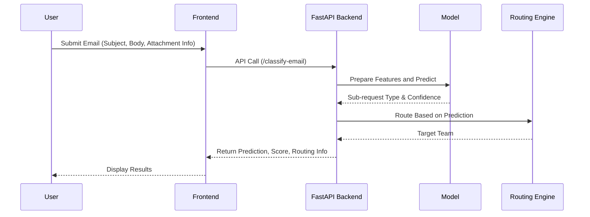

# 📧 Intelligent Email Classifier Backend (FastAPI)

This backend solution intelligently classifies emails, performs OCR-based data extraction, detects duplicates, and routes service requests—optimized for financial institutions.

## 🔁 Sequence Diagram

## 🚀 Setup Instructions
1. Install dependencies: `pip install -r requirements.txt`
2. Run server: `uvicorn app.main:app --reload`
3. Access docs: `http://localhost:8000/docs`

## ✅ Automated Testing Summary
- sample_test_inputs.json
- sample_test_scenarios.csv
- test_email_classifier.py
Run tests: `python test_email_classifier.py`
