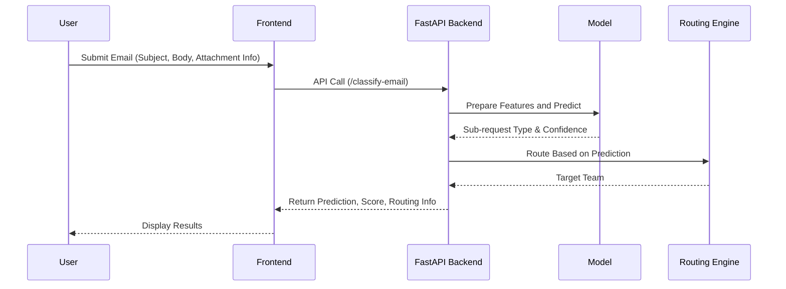

# README.md

## 📧 Intelligent Email Classifier Backend (FastAPI)

This repository contains a robust and scalable FastAPI backend solution designed to intelligently classify incoming emails, perform OCR-based data extraction, detect duplicates, and automate routing decisions. It is tailored especially for financial institutions to enhance customer service operations and streamline loan servicing workflows.

Whether an email has a body, attachment, or both, this system uses advanced machine learning models and customizable rules to:
- Categorize the email into a **Request Type** and **Sub-request Type**.
- Decide the **Priority Source** (Email Body, Attachment, or Both).
- Extract critical structured data (e.g., loan numbers, amounts).
- Flag potential duplicates with reasoning.
- Recommend or automatically route the request to the correct team.

---

## 🔁 Sequence Diagram
This diagram outlines the typical flow of how an email is processed by the system:



---

## 🚀 Getting Started - Run the Backend Locally

Follow these steps to get the backend server up and running:

### 1. 📦 Install Python Dependencies
Make sure you have Python installed. Then run:
```bash
pip install -r requirements.txt
```

### 2. ▶️ Start the FastAPI Server
```bash
uvicorn app.main:app --reload
```

### 3. 🌐 View Interactive API Documentation
Once the server is running, visit:
```
http://localhost:8000/docs
```

---

## 🧠 API Endpoints Overview
| Endpoint | Description |
|----------------------|-----------------------------------------------------------|
| POST `/classify-email` | Classifies email into request/sub-request type and returns confidence score with routing info |
| POST `/extract-fields` | Extracts relevant structured fields based on email content or attachment |
| POST `/check-duplicate` | Detects duplicate emails based on subject, body, and metadata |
| POST `/route-request` | Suggests appropriate team/individual for request routing |
| GET `/health` | Returns system health status |

---

## 📂 Project Structure & Files
- `app/main.py` → Core FastAPI app and route handlers
- `requirements.txt` → Python dependencies
- `email_classifier_with_priority_model.joblib` → Pretrained classification model
- `tfidf_vectorizer.joblib` → TF-IDF vectorizer used during feature engineering
- `README.md` → Documentation and instructions (this file)

---

## 📈 System Features and Capabilities
- ✅ Multi-level email classification with **confidence scoring**
- ✅ Detection of **primary intent** in multi-request emails
- ✅ **Dynamic priority source detection** (Email Body, Attachment, or Both)
- ✅ **Numerical field extraction** from unstructured text or scanned attachments (OCR)
- ✅ **Duplicate detection logic** with clear reasons for flagging
- ✅ **Smart routing engine** to recommend proper team/department

---

## 📬 Sample Request (POST `/classify-email`)
```json
{
  "subject": "Need loan foreclosure statement",
  "body": "Kindly share my loan pre-closure document",
  "has_attachment": true,
  "priority_source": "Email Body"
}
```

## 📤 Sample Response
```json
{
  "predicted_sub_request_type": "Pre-Closure Statement",
  "confidence_score": 0.942,
  "routing_action": "Route to Loan Operations Team"
}
```

---

## 📢 Contribution & Extension
Feel free to fork this repository, raise issues, or submit pull requests. You can also extend the system by integrating:
- New sub-request types and rule definitions
- Advanced duplicate detection heuristics
- More robust OCR preprocessing pipelines

---

## 📎 License
MIT License — free to use, modify, and distribute with credit.

---
